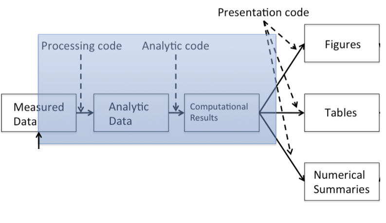
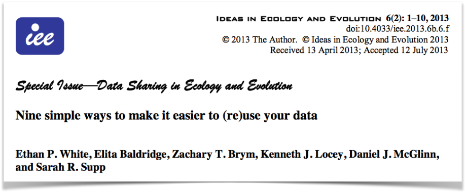
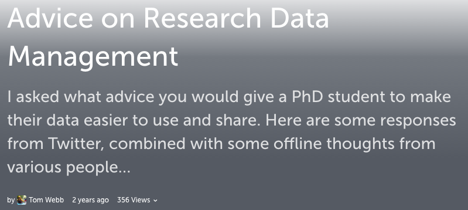
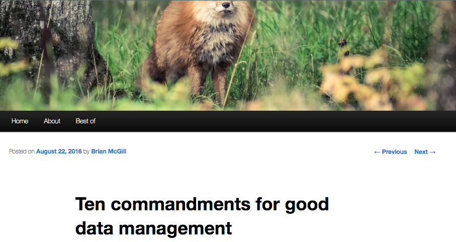
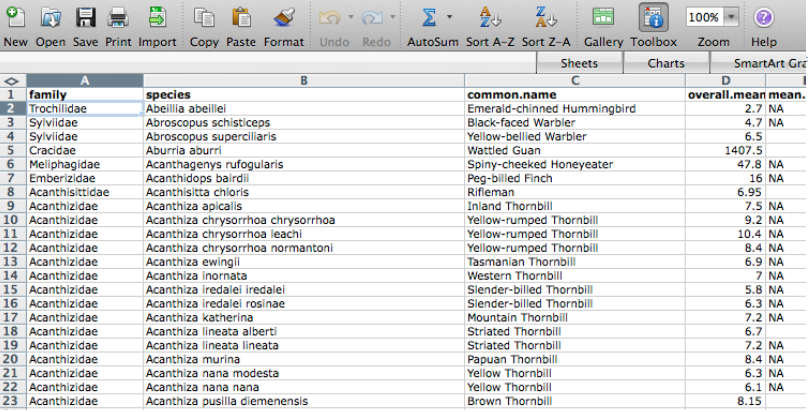
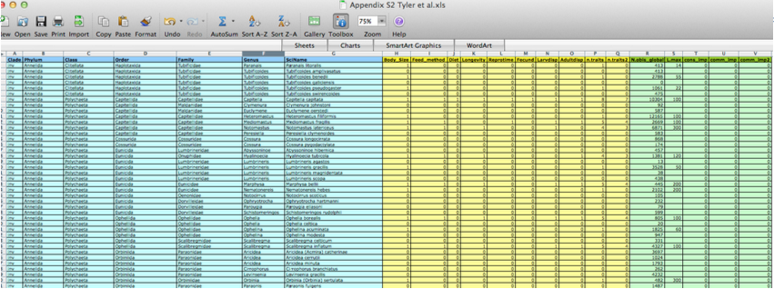

<script>window.twttr = (function(d, s, id) {
  var js, fjs = d.getElementsByTagName(s)[0],
    t = window.twttr || {};
  if (d.getElementById(id)) return t;
  js = d.createElement(s);
  js.id = id;
  js.src = "https://platform.twitter.com/widgets.js";
  fjs.parentNode.insertBefore(js, fjs);

  t._e = [];
  t.ready = function(f) {
    t._e.push(f);
  };

  return t;
}(document, "script", "twitter-wjs"));</script>


## me | Macroecologist


<div class="fullback" background-image:"assets/img/qa.png">
</div>


## 
### Quality assurance


## 

### Stock control


# workshop motivation

> why Research Data Management?


## Technological progress in Science

<p class="accent_border"><b>Technology is increasing data collection throughput</b></p>

- data are more complex and high-dimensional
- existing databases ***can*** be merged to become bigger databases

<p class="accent_border"><b>Computing power allows more sophisticated analyses</b></p>

- even on "small" data
- for every field `"X"` there is a `"Computational X"`

<p class="accent_border"><b>powerful statistical tools freely available</b></p>

- active open source communities developing data science tools
- built on a foundation of key digital literacy skills

## the internet


## Information overload

- one
- two


## replicability crisis

> attempts to reproduce published results of many scientific experiments are difficult or impossible to replicate on subsequent investigation, either by independent researchers or by the original researchers themselves.


##

### The big question:
#### How much can we trust published results?

<br>

- convergence of a number of drivers.
    - some part of the scientific process
    - some statistical resulting of biases introduced by publication system:
    - some by methodological failures and errors.
        - some very low hanging fruit here
    
<p class="accent_border"><b>at the very least we need to aim towards **reproducing result from code and data**</b></p> 

## the pitfalls of #OtherPeoplesData

<iframe width="500" height="250" src="https://www.youtube.com/embed/N2zK3sAtr-4" frameborder="0" allowfullscreen></iframe>


## culture wars

<blockquote class="twitter-tweet" data-lang="en"><p lang="en" dir="ltr">I think I have seen the worse <a href="https://twitter.com/hashtag/otherpeoplesdata?src=hash">#otherpeoplesdata</a> yet. There is not a SINGLE thing done right. NOT ONE.</p>&mdash; Timothée Poisot (@tpoi) <a href="https://twitter.com/tpoi/status/821753714755194880">January 18, 2017</a></blockquote>
<script async src="//platform.twitter.com/widgets.js" charset="utf-8"></script>

<blockquote class="twitter-tweet" data-lang="en"><p lang="en" dir="ltr">&quot;It&#39;s on github. It&#39;s documented. It&#39;s tested. No need to ask permission, just...take it away and let me know if you run into any problems.&quot; <a href="https://t.co/gZFWQ2ROQG">https://t.co/gZFWQ2ROQG</a></p>&mdash; Titus Brown (@ctitusbrown) <a href="https://twitter.com/ctitusbrown/status/821784991608643584">January 18, 2017</a></blockquote>
<script async src="//platform.twitter.com/widgets.js" charset="utf-8"></script>


## the core of reproducibility



- provide access to code and data.
- allows us to check section `raw` ➙ **published results**


## more broader open sciences

focus on reproducibility underpinned by more fundamental qualities:

- openness
- transaparency
- aceessibility
- reusability
- collaboration


### #OpenScience


## stiffling science?

<p class="accent_border"><b>critics say it's constraining, wasted time for which researchers won't be rewarded.</p></b>

#### But this ignores:
- the value of code and data to other researchers
- th eimpact such research outputs can have
- the technological capacity for producing these outputs through standard openly avalable tools.

#### clealy a balance is needed

### but so higher standards are both possible and imperative


## A more collaborative approach.

origins in open source software communities. see [SCIENCE X PYTHON](http://billmills.github.io/scienceXpython/#1)

#### Both selfish and self-less motivations. But change incentive system

### Contributor
- broader impact of research outputs like code and data
- more opportunity for recognition for diverse but useful outputs
- skills are very transferable and employable

### Community benefits
- innovation
- efficient reuse of resources
- capacity building
- quality control

## Drivers of better data management

- Funders: value for money, impact, reputation
    - NERC data policy
- Publishers: many now require code and data.
- Supervisors and immediate research group
- Your wider scientific community

### Yourselves! 

#### be your own best friend:

> aim to create secure datasets that are easy to use and REUSE

# so...where do you come in?

## RDM at postgraduate level 


<blockquote class="twitter-tweet" data-conversation="none" data-lang="en"><p lang="en" dir="ltr"><a href="https://twitter.com/tomjwebb">@tomjwebb</a> &quot;Remember what you did in your Master program? Yeah? Well, don&#39;t do that anymore.&quot;</p>&mdash; Nate Hough-Snee (@NHoughSnee) <a href="https://twitter.com/NHoughSnee/status/556235794466082816">January 16, 2015</a></blockquote>
<script async src="//platform.twitter.com/widgets.js" charset="utf-8"></script>

<blockquote class="twitter-tweet" data-conversation="none" data-lang="en"><p lang="en" dir="ltr">Act as though every short term study will become a long term one <a href="https://twitter.com/tomjwebb">@tomjwebb</a>. Needs to be reproducible in 3, 20, 100 yrs</p>&mdash; oceans initiative (@oceansresearch) <a href="https://twitter.com/oceansresearch/status/556107891610894337">January 16, 2015</a></blockquote>
<script async src="//platform.twitter.com/widgets.js" charset="utf-8"></script>

## Plan your RDM {data-background="https://raw.githubusercontent.com/BillMills/scienceXpython/gh-pages/img/debugging.gif"}

- **Start early**. Make an RMD plan before collecting data.

- Anticipate **data products** as part of your thesis **outputs**
- Think about what technologies to use

### **Take initiative. You are now responsible:**

<br>


## {.columns-2}

#### BES guide to data management


<br>

This guide for early career researchers explains what data and data management are, and provides advice and examples of best practices in data management, including case studies from researchers currently working in ecology and evolution.

<br>

#### [download](http://www.britishecologicalsociety.org/wp-content/uploads/Publ_Data-Management-Booklet.pdf)

##

#### Nine simple ways to make it easier to (re)use your data

<br>

We describe nine simple ways to make it easy to reuse the data that you share and also make it easier to work with it yourself. Our recommendations focus on making your data understandable, easy to analyze, and readily available to the wider community of scientists.

<br>




#### [download](http://ojs.library.queensu.ca/index.php/IEE/article/view/4608/4898)

##

#### [storify](https://storify.com/tomjwebb/advice-on-research-data-management) by Tom Webb [\@tomjwebb](https://twitter.com/tomjwebb)

<br>




##

#### [blog post](https://dynamicecology.wordpress.com/2016/08/22/ten-commandments-for-good-data-management/) by Dynamic ecology [\@DynamicEcology](https://twitter.com/DynamicEcology)

<br>




##

### data carpentry

- available [free online](http://www.datacarpentry.org/lessons/#ecology-workshop)
- look out for training sessions


## 

### **seek help from support teams**

Most university libraries have assistants dedicated to RDM:

<blockquote class="twitter-tweet" data-conversation="none" data-lang="en"><p lang="en" dir="ltr"><a href="https://twitter.com/tomjwebb">@tomjwebb</a> <a href="https://twitter.com/ScientificData">@ScientificData</a> Talk to their librarian for data management strategies <a href="https://twitter.com/hashtag/datainfolit?src=hash">#datainfolit</a></p>&mdash; Yasmeen Shorish (@yasmeen_azadi) <a href="https://twitter.com/yasmeen_azadi/status/556129700129800192">January 16, 2015</a></blockquote>
<script async src="//platform.twitter.com/widgets.js" charset="utf-8"></script>


# Data collection 

## Before collection
- if you're going to record data manually, produce data entry sheets or tables. Design them with both ease of entry and digitisation in mind.
- if you are doing fieldwork consider using a pencil!
- think in good time about variable definitions and naming
- think about what other ancilliary data might be useful. Include in your collection plan

<br>

<blockquote class="twitter-tweet" data-conversation="none" data-lang="en"><p lang="en" dir="ltr"><a href="https://twitter.com/tomjwebb">@tomjwebb</a> at minimum conform units, data fields to existing public databases,  traits=TRY,  collections=DarwinCore, plots=SALVIASVegBank</p>&mdash; Brian J. Enquist (@bjenquist) <a href="https://twitter.com/bjenquist/status/556122032123826177">January 16, 2015</a></blockquote>
<script async src="//platform.twitter.com/widgets.js" charset="utf-8"></script>


## record...everything! 

#### Even details that seem insignificant may prove vital to your research, or to interoperability with others' work:

<blockquote class="twitter-tweet" data-conversation="none" data-lang="en"><p lang="en" dir="ltr"><a href="https://twitter.com/tomjwebb">@tomjwebb</a> record every detail about how/where/why it is collected</p>&mdash; Sal Keith (@Sal_Keith) <a href="https://twitter.com/Sal_Keith/status/556110605053349888">January 16, 2015</a></blockquote>
<script async src="//platform.twitter.com/widgets.js" charset="utf-8"></script>


## Data entering

### an extreme but in many ways defendable approach

<blockquote class="twitter-tweet" data-conversation="none" data-lang="en"><p lang="en" dir="ltr"><a href="https://twitter.com/tomjwebb">@tomjwebb</a> stay away from excel at all costs?</p>&mdash; Timothée Poisot (@tpoi) <a href="https://twitter.com/tpoi/status/556107000950829056">January 16, 2015</a></blockquote>
<script async src="//platform.twitter.com/widgets.js" charset="utf-8"></script>

## excel: `read only`

<blockquote class="twitter-tweet" data-conversation="none" data-cards="hidden" data-lang="en"><p lang="en" dir="ltr"><a href="https://twitter.com/tomjwebb">@tomjwebb</a> <a href="https://twitter.com/tpoi">@tpoi</a> excel is fine for data entry. Just save in plain text format like csv. Some additional tips: <a href="https://t.co/8fUv9PyVjC">pic.twitter.com/8fUv9PyVjC</a></p>&mdash; Jaime Ashander (@jaimedash) <a href="https://twitter.com/jaimedash/status/556113131932381185">January 16, 2015</a></blockquote>
<script async src="//platform.twitter.com/widgets.js" charset="utf-8"></script>

<blockquote class="twitter-tweet" data-conversation="none" data-lang="en"><p lang="en" dir="ltr"><a href="https://twitter.com/jaimedash">@jaimedash</a> just don’t let excel anywhere near dates or times.  <a href="https://twitter.com/tomjwebb">@tomjwebb</a> <a href="https://twitter.com/tpoi">@tpoi</a> <a href="https://twitter.com/larysar">@larysar</a></p>&mdash; Dave Harris (@davidjayharris) <a href="https://twitter.com/davidjayharris/status/556126474550263809">January 16, 2015</a></blockquote>
<script async src="//platform.twitter.com/widgets.js" charset="utf-8"></script>

## spreadsheet advice 

<blockquote class="twitter-tweet" data-cards="hidden" data-lang="en"><p lang="en" dir="ltr">God bless the UK Gov’t Statistical Service Good Practice Team. Sane spreadsheet advice. <a href="https://t.co/MLQMvnBzkV">https://t.co/MLQMvnBzkV</a> <a href="http://t.co/OD7GzfVKLW">pic.twitter.com/OD7GzfVKLW</a></p>&mdash; Jenny Bryan (@JennyBryan) <a href="https://twitter.com/JennyBryan/status/538013071826898944">November 27, 2014</a></blockquote>
<script async src="//platform.twitter.com/widgets.js" charset="utf-8"></script>

## databases: more robust

- good qc and advisable for multiple contributors

<blockquote class="twitter-tweet" data-conversation="none" data-lang="en"><p lang="en" dir="ltr"><a href="https://twitter.com/tomjwebb">@tomjwebb</a> databases? <a href="https://twitter.com/swcarpentry">@swcarpentry</a> has a good course on SQLite</p>&mdash; Timothée Poisot (@tpoi) <a href="https://twitter.com/tpoi/status/556142573308608513">January 16, 2015</a></blockquote>
<script async src="//platform.twitter.com/widgets.js" charset="utf-8"></script>

<blockquote class="twitter-tweet" data-conversation="none" data-lang="en"><p lang="en" dir="ltr"><a href="https://twitter.com/tomjwebb">@tomjwebb</a> <a href="https://twitter.com/tpoi">@tpoi</a> if the data are moderately complex, or involve multiple people, best to set up a database with well designed entry form 1/2</p>&mdash; Luca Borger (@lucaborger) <a href="https://twitter.com/lucaborger/status/556226732496535552">January 16, 2015</a></blockquote>
<script async src="//platform.twitter.com/widgets.js" charset="utf-8"></script>


## databases: benefits {.columns-2}

<blockquote class="twitter-tweet" data-conversation="none" data-lang="en"><p lang="en" dir="ltr"><a href="https://twitter.com/tomjwebb">@tomjwebb</a> Entering via a database management system (e.g., Access, Filemaker) can make entry easier &amp; help prevent data entry errors <a href="https://twitter.com/tpoi">@tpoi</a></p>&mdash; Ethan White (@ethanwhite) <a href="https://twitter.com/ethanwhite/status/556119480493813760">January 16, 2015</a></blockquote>
<script async src="//platform.twitter.com/widgets.js" charset="utf-8"></script>

<blockquote class="twitter-tweet" data-conversation="none" data-lang="en"><p lang="en" dir="ltr"><a href="https://twitter.com/tomjwebb">@tomjwebb</a> it also prevents a lot of different bad practices. It is possible to do some of this in Excel. <a href="https://twitter.com/tpoi">@tpoi</a></p>&mdash; Ethan White (@ethanwhite) <a href="https://twitter.com/ethanwhite/status/556119826582605824">January 16, 2015</a></blockquote>
<script async src="//platform.twitter.com/widgets.js" charset="utf-8"></script>

<br>
<br>
<br>


<blockquote class="twitter-tweet" data-conversation="none" data-lang="en"><p lang="en" dir="ltr"><a href="https://twitter.com/ethanwhite">@ethanwhite</a> +1 Enforcing data types, options from selection etc, just some useful things a DB gives you, if you turn them on <a href="https://twitter.com/tomjwebb">@tomjwebb</a> <a href="https://twitter.com/tpoi">@tpoi</a></p>&mdash; Gavin Simpson (@ucfagls) <a href="https://twitter.com/ucfagls/status/556120176748290048">January 16, 2015</a></blockquote>
<script async src="//platform.twitter.com/widgets.js" charset="utf-8"></script>


## data formats

- csv files most common
- Text files are the most general file format


<blockquote class="twitter-tweet" data-conversation="none" data-lang="en"><p lang="en" dir="ltr"><a href="https://twitter.com/tomjwebb">@tomjwebb</a> It has to be interoperability/openness - can I read your data with whatever I use, without having to convert it?</p>&mdash; Paul Swaddle (@paul_swaddle) <a href="https://twitter.com/paul_swaddle/status/556148166270406656">January 16, 2015</a></blockquote>
<script async src="//platform.twitter.com/widgets.js" charset="utf-8"></script>

- more unusual formats will need instruction on use.

## ensure data is machine readable

### bad


##

### bad


##

### good 


##

### ok



- could help data entry
- `.csv` copy would need to be saved.

## file naming

- **Give files descriptive, consistent names**, e.g. “AK_IUCNDataExtraction_20131002.csv”
    - include any pertinent parameter information
    
### **machine writeable = machine readable**

```{r, eval=FALSE}
write.csv(df, paste("variable_", res, month, sep ="_"))

df <- read.csv(paste("variable_", res, month, sep ="_"))

```


## Use good null values

### Missing values are a fact of life

- Usually, best solution is to **leave blank**
- **`NA`** or **`NULL`** are also good options
- **NEVER use `0`**. Avoid numbers like **`-999`**
- Don’t make up your own code for missing values


## [**`read.csv()`**](http://stat.ethz.ch/R-manual/R-devel/library/utils/html/read.table.html) utilities

- **`na.string`:** character vector of values to be coded missing and replaced with `NA` to argument eg
- **`strip.white`:** Logical. if `TRUE` strips leading and trailing white space from unquoted character fields 
- **`blank.lines.skip`:** Logical: if `TRUE` blank lines in the input are ignored.
- **`fileEncoding`:** if you're getting funny characters, you probably need to specify the correct encoding.

```{r, eval=FALSE}
read.csv(file, na.strings = c("NA", "-999"), strip.white = TRUE, 
         blank.lines.skip = TRUE, fileEncoding = "mac")
```

## basic quality control

#### Have a look at your data with `Viewer(df)`

<br>
<br>

- Check **empty cells**
- Check the **range of values** (and value types) in each column matches expectation. Use `summary(df)`
- Check **units of measurement**
- Check your **software interprets your data correctly** eg. for a data frame `df``;
    - `head(df)` will show you  and str(df) are useful)

## make your data alignable and generalisable

What information would other users require to combine their your data with their's?

- time `temporal (time of day, day, month, year, season)`
- space `geography (lat, lon)`
- taxonomy `species name; authority / source`
- provide information on **extent** and **resolution**
- consider writing some **simple QA tests** (eg. checks against *number of dimensions*, *sum of numeric columns* etc)

# data management

## raw data are sacrosanct

<blockquote class="twitter-tweet" data-conversation="none" data-lang="en"><p lang="en" dir="ltr"><a href="https://twitter.com/tomjwebb">@tomjwebb</a> don&#39;t, not even with a barge pole, not for one second, touch or otherwise edit the raw data files. Do any manipulations in script</p>&mdash; Gavin Simpson (@ucfagls) <a href="https://twitter.com/ucfagls/status/556107371634634755">January 16, 2015</a></blockquote>
<script async src="//platform.twitter.com/widgets.js" charset="utf-8"></script>

<blockquote class="twitter-tweet" data-conversation="none" data-lang="en"><p lang="en" dir="ltr"><a href="https://twitter.com/tomjwebb">@tomjwebb</a> <a href="https://twitter.com/srsupp">@srsupp</a> Keep one or a few good master data files (per data collection of interest), and code your formatting with good annotation.</p>&mdash; Desiree Narango (@DLNarango) <a href="https://twitter.com/DLNarango/status/556128407445323778">January 16, 2015</a></blockquote>
<script async src="//platform.twitter.com/widgets.js" charset="utf-8"></script>

## from raw to analytical data

### [the repeatable pipeline](https://dynamicecology.wordpress.com/2016/08/22/ten-commandments-for-good-data-management/)
<p class="accent_border"><b>Do not manually edit raw data</b></p>

<p class="accent_border"><b>Keep a clean pipeline of data processing from raw to analytical.</b></p>


- Ideally, incorporate checks to ensure correct processing of data through to analytical.
- Clearly document any processing.
    - Well-commented script-based manipulation (e.g. in R) makes this easy
    


## Know your masters

- identify the `master` copy of files
- keep it safe and and accessible
- consider version control
- consider centralising

<br>


## avoid catastrophy

### Backup on disk

- consider using backup software like [Time Machine](https://support.apple.com/en-gb/HT201250) (mac) or [File History](http://www.thundercloud.net/infoave/new/windows-10-has-a-time-machine/) (Windows 10)


### Backup in the cloud

- dropbox, googledrive etc.
- if [installed](https://tools.google.com/dlpage/drive) on your system, can programmatically access them through `R`
- some version control

<blockquote class="twitter-tweet" data-conversation="none" data-lang="en"><p lang="en" dir="ltr"><a href="https://twitter.com/tomjwebb">@tomjwebb</a> Back it up</p>&mdash; Ben Bond-Lamberty (@BenBondLamberty) <a href="https://twitter.com/BenBondLamberty/status/556120946722222080">January 16, 2015</a></blockquote>
<script async src="//platform.twitter.com/widgets.js" charset="utf-8"></script>


## The Open Science Framework [osf.io](https://osf.io/)

<iframe width="450" height="315" src="https://www.youtube.com/embed/2TV21gOzfhw" frameborder="0" allowfullscreen></iframe>

- version controlled
- easily shareble
- works with other apps
- work on an interface with R ([OSFr](https://github.com/chartgerink/osfr)) is in progress


