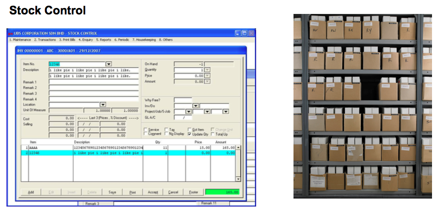
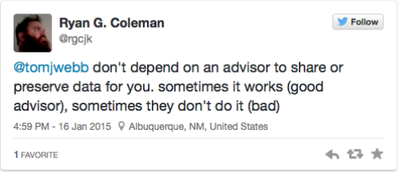
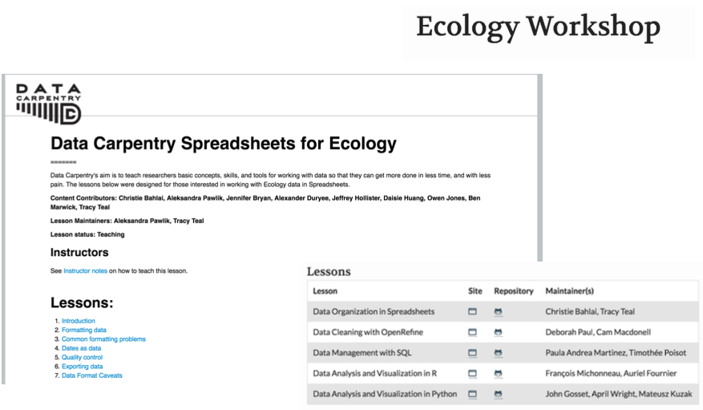

<script>window.twttr = (function(d, s, id) {
  var js, fjs = d.getElementsByTagName(s)[0],
    t = window.twttr || {};
  if (d.getElementById(id)) return t;
  js = d.createElement(s);
  js.id = id;
  js.src = "https://platform.twitter.com/widgets.js";
  fjs.parentNode.insertBefore(js, fjs);

  t._e = [];
  t.ready = function(f) {
    t._e.push(f);
  };

  return t;
}(document, "script", "twitter-wjs"));</script>


## Me | Macroecologist


<div class="fullback" background-image:"assets/img/qa.png">
</div>


## 
### Quality assurance


## 

### Stock control



## Progress in Science

## pitfalls {.columns-2}

- one
- two
- three
- four

<br>
<br>
<br>
<br>


</div>

## RDM at postgraduate level 


<blockquote class="twitter-tweet" data-conversation="none" data-lang="en"><p lang="en" dir="ltr"><a href="https://twitter.com/tomjwebb">@tomjwebb</a> &quot;Remember what you did in your Master program? Yeah? Well, don&#39;t do that anymore.&quot;</p>&mdash; Nate Hough-Snee (@NHoughSnee) <a href="https://twitter.com/NHoughSnee/status/556235794466082816">January 16, 2015</a></blockquote>
<script async src="//platform.twitter.com/widgets.js" charset="utf-8"></script>

<blockquote class="twitter-tweet" data-conversation="none" data-lang="en"><p lang="en" dir="ltr">Act as though every short term study will become a long term one <a href="https://twitter.com/tomjwebb">@tomjwebb</a>. Needs to be reproducible in 3, 20, 100 yrs</p>&mdash; oceans initiative (@oceansresearch) <a href="https://twitter.com/oceansresearch/status/556107891610894337">January 16, 2015</a></blockquote>
<script async src="//platform.twitter.com/widgets.js" charset="utf-8"></script>

## Plan  your RDM {data-background="https://raw.githubusercontent.com/BillMills/scienceXpython/gh-pages/img/debugging.gif"}

- **Start early**. Make an RMD plan before collecting data.

- Anticipate **data products** as part of your thesis **outputs**
- Think about what technologies to use

### **Take initiative. You are now responsible:**

<br>



## 

### **seek help from support teams**

Most university libraries have assistants dedicated to RDM:

<blockquote class="twitter-tweet" data-conversation="none" data-lang="en"><p lang="en" dir="ltr"><a href="https://twitter.com/tomjwebb">@tomjwebb</a> <a href="https://twitter.com/ScientificData">@ScientificData</a> Talk to their librarian for data management strategies <a href="https://twitter.com/hashtag/datainfolit?src=hash">#datainfolit</a></p>&mdash; Yasmeen Shorish (@yasmeen_azadi) <a href="https://twitter.com/yasmeen_azadi/status/556129700129800192">January 16, 2015</a></blockquote>
<script async src="//platform.twitter.com/widgets.js" charset="utf-8"></script>

## Data collection {.smaller}

- if you're going to record data manually, produce data entry sheets or tables. Design them with data digitisation in mind
- if you are doing fieldwork consider using a pencil!
- think in good time about variable definitions and naming

<br>

<blockquote class="twitter-tweet" data-conversation="none" data-lang="en"><p lang="en" dir="ltr"><a href="https://twitter.com/tomjwebb">@tomjwebb</a> at minimum conform units, data fields to existing public databases,  traits=TRY,  collections=DarwinCore, plots=SALVIASVegBank</p>&mdash; Brian J. Enquist (@bjenquist) <a href="https://twitter.com/bjenquist/status/556122032123826177">January 16, 2015</a></blockquote>
<script async src="//platform.twitter.com/widgets.js" charset="utf-8"></script>

## Data entering {.smaller}

### an extreme but in many ways defendable approach

<blockquote class="twitter-tweet" data-conversation="none" data-lang="en"><p lang="en" dir="ltr"><a href="https://twitter.com/tomjwebb">@tomjwebb</a> stay away from excel at all costs?</p>&mdash; Timothée Poisot (@tpoi) <a href="https://twitter.com/tpoi/status/556107000950829056">January 16, 2015</a></blockquote>
<script async src="//platform.twitter.com/widgets.js" charset="utf-8"></script>

## excel {.smaller}

<blockquote class="twitter-tweet" data-conversation="none" data-cards="hidden" data-lang="en"><p lang="en" dir="ltr"><a href="https://twitter.com/tomjwebb">@tomjwebb</a> <a href="https://twitter.com/tpoi">@tpoi</a> excel is fine for data entry. Just save in plain text format like csv. Some additional tips: <a href="https://t.co/8fUv9PyVjC">pic.twitter.com/8fUv9PyVjC</a></p>&mdash; Jaime Ashander (@jaimedash) <a href="https://twitter.com/jaimedash/status/556113131932381185">January 16, 2015</a></blockquote>
<script async src="//platform.twitter.com/widgets.js" charset="utf-8"></script>

<blockquote class="twitter-tweet" data-conversation="none" data-lang="en"><p lang="en" dir="ltr"><a href="https://twitter.com/jaimedash">@jaimedash</a> just don’t let excel anywhere near dates or times.  <a href="https://twitter.com/tomjwebb">@tomjwebb</a> <a href="https://twitter.com/tpoi">@tpoi</a> <a href="https://twitter.com/larysar">@larysar</a></p>&mdash; Dave Harris (@davidjayharris) <a href="https://twitter.com/davidjayharris/status/556126474550263809">January 16, 2015</a></blockquote>
<script async src="//platform.twitter.com/widgets.js" charset="utf-8"></script>

## spreadsheet advice {.smaller}

<blockquote class="twitter-tweet" data-cards="hidden" data-lang="en"><p lang="en" dir="ltr">God bless the UK Gov’t Statistical Service Good Practice Team. Sane spreadsheet advice. <a href="https://t.co/MLQMvnBzkV">https://t.co/MLQMvnBzkV</a> <a href="http://t.co/OD7GzfVKLW">pic.twitter.com/OD7GzfVKLW</a></p>&mdash; Jenny Bryan (@JennyBryan) <a href="https://twitter.com/JennyBryan/status/538013071826898944">November 27, 2014</a></blockquote>
<script async src="//platform.twitter.com/widgets.js" charset="utf-8"></script>

## databases {.smaller}

<blockquote class="twitter-tweet" data-conversation="none" data-lang="en"><p lang="en" dir="ltr"><a href="https://twitter.com/tomjwebb">@tomjwebb</a> databases? <a href="https://twitter.com/swcarpentry">@swcarpentry</a> has a good course on SQLite</p>&mdash; Timothée Poisot (@tpoi) <a href="https://twitter.com/tpoi/status/556142573308608513">January 16, 2015</a></blockquote>
<script async src="//platform.twitter.com/widgets.js" charset="utf-8"></script>

<blockquote class="twitter-tweet" data-conversation="none" data-lang="en"><p lang="en" dir="ltr"><a href="https://twitter.com/tomjwebb">@tomjwebb</a> <a href="https://twitter.com/tpoi">@tpoi</a> if the data are moderately complex, or involve multiple people, best to set up a database with well designed entry form 1/2</p>&mdash; Luca Borger (@lucaborger) <a href="https://twitter.com/lucaborger/status/556226732496535552">January 16, 2015</a></blockquote>
<script async src="//platform.twitter.com/widgets.js" charset="utf-8"></script>

## {.columns-2}

<blockquote class="twitter-tweet" data-conversation="none" data-lang="en"><p lang="en" dir="ltr"><a href="https://twitter.com/tomjwebb">@tomjwebb</a> Entering via a database management system (e.g., Access, Filemaker) can make entry easier &amp; help prevent data entry errors <a href="https://twitter.com/tpoi">@tpoi</a></p>&mdash; Ethan White (@ethanwhite) <a href="https://twitter.com/ethanwhite/status/556119480493813760">January 16, 2015</a></blockquote>
<script async src="//platform.twitter.com/widgets.js" charset="utf-8"></script>

<blockquote class="twitter-tweet" data-conversation="none" data-lang="en"><p lang="en" dir="ltr"><a href="https://twitter.com/tomjwebb">@tomjwebb</a> it also prevents a lot of different bad practices. It is possible to do some of this in Excel. <a href="https://twitter.com/tpoi">@tpoi</a></p>&mdash; Ethan White (@ethanwhite) <a href="https://twitter.com/ethanwhite/status/556119826582605824">January 16, 2015</a></blockquote>
<script async src="//platform.twitter.com/widgets.js" charset="utf-8"></script>


<blockquote class="twitter-tweet" data-conversation="none" data-lang="en"><p lang="en" dir="ltr"><a href="https://twitter.com/ethanwhite">@ethanwhite</a> +1 Enforcing data types, options from selection etc, just some useful things a DB gives you, if you turn them on <a href="https://twitter.com/tomjwebb">@tomjwebb</a> <a href="https://twitter.com/tpoi">@tpoi</a></p>&mdash; Gavin Simpson (@ucfagls) <a href="https://twitter.com/ucfagls/status/556120176748290048">January 16, 2015</a></blockquote>
<script async src="//platform.twitter.com/widgets.js" charset="utf-8"></script>

## data carpentry

http://www.datacarpentry.org/lessons/




## Then record...everything! {.smaller}

#### Even details that seem insignificant may prove vital to your research, or to interoperability with others' work:

<blockquote class="twitter-tweet" data-conversation="none" data-lang="en"><p lang="en" dir="ltr"><a href="https://twitter.com/tomjwebb">@tomjwebb</a> record every detail about how/where/why it is collected</p>&mdash; Sal Keith (@Sal_Keith) <a href="https://twitter.com/Sal_Keith/status/556110605053349888">January 16, 2015</a></blockquote>
<script async src="//platform.twitter.com/widgets.js" charset="utf-8"></script>

## Raw data are sacrosanct

<blockquote class="twitter-tweet" data-conversation="none" data-lang="en"><p lang="en" dir="ltr"><a href="https://twitter.com/tomjwebb">@tomjwebb</a> don&#39;t, not even with a barge pole, not for one second, touch or otherwise edit the raw data files. Do any manipulations in script</p>&mdash; Gavin Simpson (@ucfagls) <a href="https://twitter.com/ucfagls/status/556107371634634755">January 16, 2015</a></blockquote>
<script async src="//platform.twitter.com/widgets.js" charset="utf-8"></script>

<blockquote class="twitter-tweet" data-conversation="none" data-lang="en"><p lang="en" dir="ltr"><a href="https://twitter.com/tomjwebb">@tomjwebb</a> <a href="https://twitter.com/srsupp">@srsupp</a> Keep one or a few good master data files (per data collection of interest), and code your formatting with good annotation.</p>&mdash; Desiree Narango (@DLNarango) <a href="https://twitter.com/DLNarango/status/556128407445323778">January 16, 2015</a></blockquote>
<script async src="//platform.twitter.com/widgets.js" charset="utf-8"></script>

## Avoid catastrophy

<blockquote class="twitter-tweet" data-conversation="none" data-lang="en"><p lang="en" dir="ltr"><a href="https://twitter.com/tomjwebb">@tomjwebb</a> Back it up</p>&mdash; Ben Bond-Lamberty (@BenBondLamberty) <a href="https://twitter.com/BenBondLamberty/status/556120946722222080">January 16, 2015</a></blockquote>
<script async src="//platform.twitter.com/widgets.js" charset="utf-8"></script>

# General tips

## Data formats

- Text files are the most general file format
- csv files most common

<blockquote class="twitter-tweet" data-conversation="none" data-lang="en"><p lang="en" dir="ltr"><a href="https://twitter.com/tomjwebb">@tomjwebb</a> It has to be interoperability/openness - can I read your data with whatever I use, without having to convert it?</p>&mdash; Paul Swaddle (@paul_swaddle) <a href="https://twitter.com/paul_swaddle/status/556148166270406656">January 16, 2015</a></blockquote>
<script async src="//platform.twitter.com/widgets.js" charset="utf-8"></script>

## File naming

- #### **Give files descriptive, consistent names**, e.g. “AK_IUCNDataExtraction_20131002.csv”
- #### **Make it machine readable**

## Use good null values

### Missing values are a fact of life

- Usually, best solution is to **leave blank**
- **`NA`** or **`NULL`** are also good options
- **NEVER use `0`**. Avoid numbers like **`-999`**
- Don’t make up your own code for missing values


## data checks through [**`read.csv()`**](http://stat.ethz.ch/R-manual/R-devel/library/utils/html/read.table.html)

- **`na.string`:** character vector of values to be coded missing and replaced with `NA` to argument eg
- **`strip.white`:** Logical. if `TRUE` strips leading and trailing white space from unquoted character fields 
- **`blank.lines.skip`:** Logical: if `TRUE` blank lines in the input are ignored.
- **`fileEncoding`:** if you're getting funny characters, you probably need to specify the correct encoding.

```{r, eval=FALSE}
read.csv(file, na.strings = c("NA", "-999"), strip.white = TRUE, 
         blank.lines.skip = TRUE, fileEncoding = "mac")
```

## Perform basic quality control checks

- Check the range of values (and value types) in each column matches expectation. Use `summary(df)`
- Check empty cells
- Check units of measurement
- Check your software interprets your data correctly eg. for a data frame `df``;
    - `head(df)` will show you  and str(df) are useful)

## Make your data alignable and generalisable

What information would other users require to combine their your data with their's?

- Time `time`
- space `geography (lat, lon)`
- taxonomy `species name; authority / source`
- provide information on extent and resolution
- include some simple QA tests (eg. number of dimensions, sum of numeric columns etc)
- Before publishing consider writing some simple tests.


