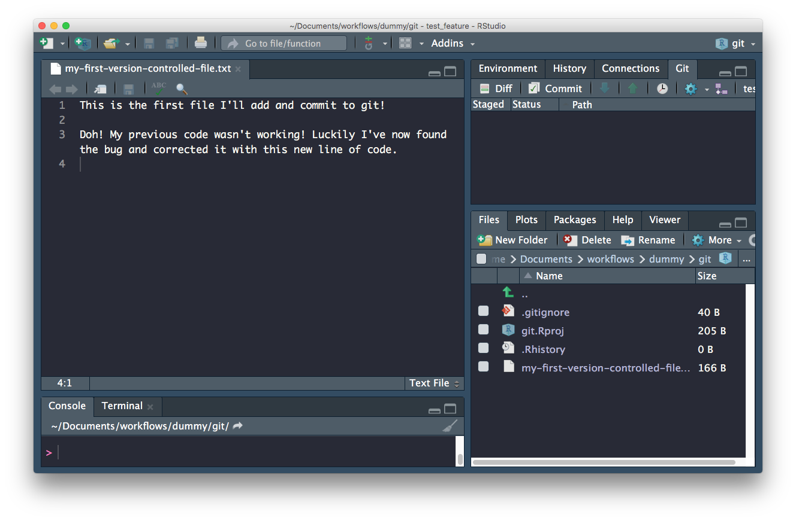

```{r setup, include=FALSE}
knitr::opts_chunk$set(echo = TRUE)
```

## What is Version control? `r emo::ji("thinking")`

The **management of changes** to documents, computer programs, large web sites, and other collections of information.

## Where did it come from?

> The need for a logical way to organize and control revisions has existed for almost as long as writing has existed,  but revision control became much more important, and complicated when the era of computing began

---

## Elements of a VC system

- Changes are usually identified by a number or letter code, termed the "revision number"

- Each revision is associated with a timestamp and the person making the change. 

- Revisions can be compared, restored, and with some types of files, merged.

---

## What is git?

An open source (free to use) Version control system


---

## Where did it come from?

Git development began in 2006 after many developers of the Linux kernel gave up access to [BitKeeper](http://www.bitkeeper.org/) (at the time the best but proprietary)

Linus Torvalds on the name **`git`**: 

> "I'm an egotistical bastard, and I name all my projects after myself. First 'Linux', now 'git'

<small>More on the name in the source code original [readme](https://github.com/git/git/tree/e83c5163316f89bfbde7d9ab23ca2e25604af290) file</small>

---

## What is GitHub

---

## Why use it in research? 

### Exhibit A


---

## Why use it in research? 

### Exhibit B


---

## How does `Git` work?

When a local directory becomes ***initialised with git***, a **hidden `.git` folder is added** to it.

> it's now called a **repository**


---
## Enough theory, how about in practice!

### First, `git` needs to know who you are so your commits can be attributed to you


```
git config --global --list
```


----


In the R console
```{r, eval = F}
usethis::use_git()
```

In the terminal
```
git init
```

### tracking files

- Add files to **staging area**

- Commit staged files (if it's the first commit)/changes (if it's a change to a file)
    + This adds the files/changes to the `.git` folder

- Commit stamped with the name of the author and the time & date

## Confused? You are not alone!


---

## Rstudio to the rescue!

### Rstudio + `usethis` `r emo::ji("package")` == heavenly `Git` & `GitHub`

- Initialise **Rstudio project** with Git by **just checking a box!**
    - Forgot to? use `usethis::use_git()`


---

### first commit - whole file added


---

### second commit - whole file added


---




## Branches

```
git branch test-feature
git checkout test-feature

```

```
git checkout -B test_feature

```


## Branches

---

## Remotes


---

## Further Resources

- [Git-it]()
- [Happy with Git]()
- [Oh Shit Git](http://ohshitgit.com/)


---


## Never forget


